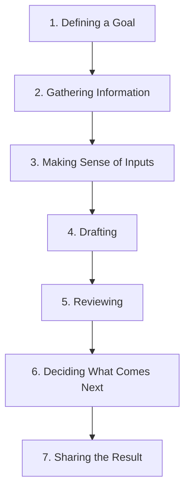

# Module 1: AI Workflows & Foundational Frameworks

> **Source Course:** OpenAI Academy – Applied AI Foundation  
> **Topic:** Introduction to AI Workflows vs. Single Prompts, Core Workflow Anatomy, and Getting Started

---

## 1. Overview & Core Philosophy

An **AI Workflow** is a structured, repeatable sequence of steps designed to accomplish complex tasks using AI capabilities. 

### Why Use an AI Workflow?
When tackling real-world projects, relying on a single prompt is rarely sufficient. 

| Single Prompt ❌ | AI Workflow ✅ |
| :--- | :--- |
| Limited context and scope | Best suited for well-fledged, large, and complex tasks |
| High chance of missing requirements | Clearly defined steps, checkpoints, and quality controls |
| Hard to review or iterate on | Process is transparent, easy to review, and repeatable |

> **Core Goal of an AI Workflow:** To make the entire process clearer, easier to review, and effortlessly repeatable.

---

## 2. The 7-Step Core AI Workflow

The foundational AI workflow follows a 7-stage lifecycle from goal definition to output sharing:



### Breakdown of the 7 Steps:
1. **Defining a Goal:** Clearly establish what outcome or deliverable you want to achieve.
2. **Gathering Information:** Collect necessary documents, data, instructions, and context.
3. **Making Sense of Inputs:** Analyze, organize, and summarize the gathered information for the AI.
4. **Drafting:** Use AI to generate initial drafts, outlines, or prototypes.
5. **Reviewing:** Evaluate the AI-generated outputs for accuracy, completeness, and tone.
6. **Deciding What Comes Next:** Determine whether to refine, proceed to the next step, or pivot.
7. **Sharing the Result:** Distribute the finalized output to stakeholders or integrate it into production.

---

## 3. The 5-Part Workflow Architecture

Every robust workflow consists of **5 essential components**:

```
┌────────────────────────────────────────────────────────────────────────┐
│                        5-Part Workflow Anatomy                         │
├──────────────┬───────────────┬────────────┬──────────────┬─────────────┤
│   1. Goal    │  2. Context   │  3. Steps  │ 4. Checkpoint│  5. Output  │
│ (Target Result) (Background Info) (Execution) (Human Review) (Deliverable)│
└──────────────┴───────────────┴────────────┴──────────────┴─────────────┘
```

1. **Goal:** What you are trying to accomplish.
2. **Context:** Background information, rules, and reference materials supplied to the AI.
3. **Steps:** The explicit, ordered actions taken by both human and AI.
4. **Checkpoints:** Designated review points to check quality, accuracy, and alignment.
5. **Output:** The final, polished deliverable.

---

## 4. How to Get Started & Choose a Workflow

### 4.1 Getting Started (The MVP Approach)
Do not try to build an overly complex workflow on day one. Follow this progressive loop:

```
Define a Goal ──> Start with a Draft ──> Review Output ──> Adjust as Needed
```

### 4.2 Criteria for Choosing an AI Workflow
Select or design a workflow based on the following benchmark criteria:
- **Timeline:** Keep execution on a clear timeline (**weekly cadence is ideal**).
- **Clear Outcome:** Ensure there is an explicit deliverable or tangible output.
- **Structure:** Contains clear intermediate steps and decision points.
- **Review Opportunity:** Built-in opportunities to inspect, reflect, and improve the work.
- **Safety & Privacy:** Allows practice and execution without exposing highly sensitive or confidential data.
