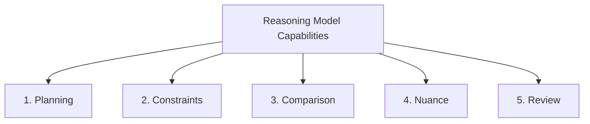

# Module 2: Reasoning Models & Structured Prompting Framework

> **Source Course:** OpenAI Academy – Applied AI Foundation  
> **Topic:** Understanding Reasoning Models, 5 Core Capabilities, Structured Outputs, and Refinement Loops

---

## 1. Understanding Reasoning Models

Reasoning models are highly capable, long-thinking AI models engineered to perform deep analysis, multi-step problem solving, and logical verification before producing an answer.

### When to Use Reasoning Models
Reasoning models excel in complex scenarios that involve:
1. **Several Conditions:** Evaluating multiple constraints or multi-variable business rules simultaneously.
2. **Multiple Possible Paths:** Exploring and weighing branching logic or trade-offs.
3. **Direction of Recommendation:** Providing strategic guidance with long-term implications.
4. **Planning with Dependencies:** Structuring tasks where Step B strictly depends on Step A.
5. **Option Comparison:** Systematically comparing alternatives against quantitative or qualitative criteria.
6. **Work Verification:** Checking draft outputs against rigorous validation guidelines.

---

## 2. The 5 Power Capabilities of Reasoning

Reasoning models help primarily across **5 main dimensions**:



1. **Planning:** Structuring complex, multi-stage execution strategies.
2. **Constraints:** Respecting strict rules, guardrails, and boundary parameters.
3. **Comparison:** Objective side-by-side analysis of choices, solutions, or designs.
4. **Nuance:** Capturing subtle edge cases, contextual tone, and implicit requirements.
5. **Review:** Auditing outputs for logical consistency, accuracy, and completeness.

---

## 3. Direction vs. Model Logic vs. Structured Output

To get the most out of a reasoning model, align your instructions with how the model processes information to produce structured outputs:

| Your Direction (Input) | Reasoning Model Processing | Structured Output (Deliverable) |
| :--- | :--- | :--- |
| **1. Set the Goal** | Organizes and structures information | **Clear Plan** |
| **2. Give Context** | Validates internal logic & assumptions | **Step-by-Step Answer** |
| **3. Add Guardrails** | Builds systematic framework | **Useful Framework** |
| *(Continuous)* | Identifies gaps and edge cases | **More Structured Work** |

---

## 4. The Prompt Engineering & Refinement Loop

Prompting is an iterative feedback loop. Rather than expecting perfection on the first turn, systematically refine your prompts based on evaluation:


### The Formula for Effective Prompting & Workflows

$$\text{Goal} + \text{Context} + \text{Guardrails} \longrightarrow \text{Check Work} \longrightarrow \text{Refine}$$

```markdown
- Step 1: Set the goal clearly.
- Step 2: Supply relevant context and background information.
- Step 3: Provide explicit guardrails (constraints & format rules).
- Step 4: Check and evaluate the output against standards.
- Step 5: Refine the prompt and iterate.
```
