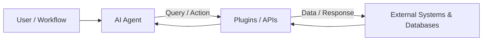

# Module 3: Tools, Plugins & AI Capability Selection

> **Source Course:** OpenAI Academy – Applied AI Foundation  
> **Topic:** Integrating Tools & Plugins, Project Management Tools (OpenProject, Kanban), and Capability Mapping

---

## 1. Tools & Reasoning (The 3-Module Principle)

When constructing an AI workflow, always follow the principle of **choosing the simplest useful capability**. Avoid over-engineering.

### When to Integrate Tools
Integrate external tools into your AI workflow when they:
- **Ground the work:** Supply factual data and real-time truth, preventing hallucinations.
- **Reduce guessing:** Allow the AI to query databases or APIs directly.
- **Simplify review:** Make human verification faster and more straightforward.

---

## 2. Plugins & Agentic Integrations

### What are Plugins?
**Plugins** are specialized tools that connect AI Agents to external APIs, enabling agents to retrieve live information, execute remote actions, and interact with third-party platforms.



### Case Study: Project Management with OpenProject & Kanban
During the course, **OpenProject** (an open-source project management and task-tracking platform) was highlighted as a key tool for managing workflows via Kanban boards.

#### Standard Kanban Workflow Stages:
```
┌──────────────┐      ┌──────────────┐      ┌──────────────┐      ┌──────────────┐
│    To Do     │ ───> │ In Progress  │ ───> │    Review    │ ───> │     Done     │
└──────────────┘      └──────────────┘      └──────────────┘      └──────────────┘
```

#### Key Productivity Tool Matrix to Master:
- **OpenProject:** Open-source project management, task breakdown, and Kanban tracking.
- **Slack:** Team communication, real-time alerts, and agent notifications.
- **Notion:** Knowledge management, documentation, and workflow notes repository.

---

## 3. Choosing the Right AI Capability (The 3.6 Capability Matrix)

Select the appropriate AI modality or tool based on the specific requirement of each sub-task:

| Capability Modality | Best Use Case & Scenario |
| :--- | :--- |
| **Reasoning Models** | Complex planning, multi-option comparison, and logic verification. |
| **File Extraction** | Extracting text, schemas, or specific data points from PDFs/documents. |
| **Data Analysis** | Processing spreadsheets (CSV/XLSX), financial models, & structured data. |
| **Search & Deep Research** | Real-time web browsing, literature search, and deep topic synthesis. |
| **Multimodal Inputs** | Image analysis, diagrams, handwritten note extraction, voice notes. |
| **Plugins & Agents** | Autonomous multi-step execution, API interaction, database lookups. |
