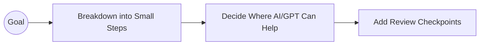

# Module 4: Workflow Design & Setting Up AI Skills

> **Source Course:** OpenAI Academy – Applied AI Foundation  
> **Topic:** End-to-End Workflow Architecture, Workflow Notes, and Packaging Skills

---

## 1. Designing an AI Workflow

Designing a successful AI workflow requires breaking down a macro objective into structured micro-steps with embedded review checkpoints.

### 4.1 Workflow Design Blueprint



#### Steps in Workflow Design:
1. **Start with the Goal:** Clearly define the final desired outcome.
2. **Breakdown into Small Steps:** Divide the objective into discrete, manageable sub-tasks.
3. **Determine AI Assistance Points:** Identify exactly which sub-tasks benefit from AI generation, reasoning, or analysis.
4. **Embed Review Checkpoints:** Insert explicit human validation points where quality must be inspected before proceeding.

### 4.2 Workflow Notes
**Workflow Notes** are concise, written documentations created to "wrap around the important things"—ensuring context, rules, and procedures remain preserved across iterations.

---

## 2. Setting Up an AI Skill (Section 4.6)

### What is an AI Skill?
An **AI Skill** is a standardized set of instructions, examples, and user preferences that teaches an AI model **how to complete a task exactly the way you do**.

```
Skill = Instructions + Examples + User Preferences
```

### The 5-Part Skill Structure
To turn a routine workflow into a reusable Skill, define these 5 components:

```
1. Repeatable Process  ──> High-level routine description
2. Clear Inputs        ──> Exact data & files required
3. Useful Steps        ──> Step-by-step execution instructions
4. Defined Output      ──> Standardized format & template
5. Final Quality Checks ──> Verification checklist before completion
```

---

## 3. Weekly Skill Reflection Framework

A key practice recommended in the course is building and refining skills on a **weekly cadence** after executing workflows.

### Reflection Prompt Template for Skill Creation
Use the following prompt format to convert your completed workflow notes into a reusable Skill:

```markdown
I am completing my weekly Meeting Workflow Pack. Help me reflect on the workflow I have built so far.

Please structure the reflection using these exact headings:
1. My Repeatable Workflow
2. My Required Inputs
3. My Step-by-Step Process
4. My Output Format
5. My Final Quality Checks
6. Where GPT Can Help Me Most
```

### Summary Vision
The ultimate goal of skill setup is to turn a **Broad, Unstructured Goal ☀️** into a **Structured, Reusable Workflow**:

$$\text{Broad Goal } \left(\text{☀️}\right) \xrightarrow{\quad \text{Skill System} \quad} \text{Structured AI Workflow}$$
