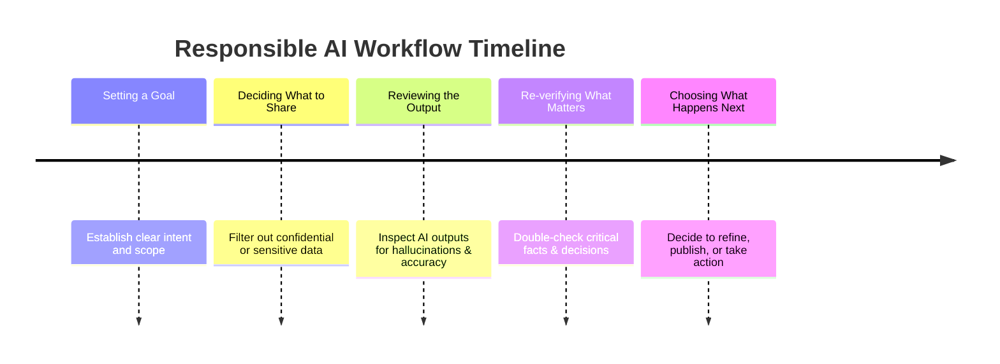

# Module 5: Responsible AI Workflows & Human-in-the-Loop Evaluation

> **Source Course:** OpenAI Academy – Applied AI Foundation  
> **Topic:** Responsible AI Lifecycle, Workflow Reflection, Task Categorization, and Human Oversight

---

## 1. The Responsible AI Workflow Lifecycle

Responsible AI usage ensures that AI-assisted workflows remain accurate, ethical, safe, and aligned with practical goals.



### Core Objective:
To make AI **more accurate**, **more responsible**, and **more useful** across all operations.

---

## 2. Continuous Workflow & Prompt Evaluation

To prevent workflow degradation and maintain high standards, perform periodic evaluations across two key dimensions:

### A. Workflow Reflection (Systemic Evaluation)
- **Where did GPT help most?** Identify high-leverage steps where AI accelerated productivity.
- **Where did the workflow drift?** Spot areas where the AI diverged from instructions or goals.
- **Where capability added value vs. added complexity?** Eliminate unnecessary tools or steps that created friction without benefit.

### B. Prompt & Note Evaluation (Tactical Evaluation)
- **Which prompt or workflow note helped most?** Pinpoint high-performing prompt templates.
- **What did I need to verify?** Note items that required manual fact-checking or correction.
- **What should I change next time?** Update instructions to prevent repeated mistakes.

---

## 3. Categorizing Workflow Steps for Delegation

Not all tasks should be treated equally when building AI workflows. Categorize steps into 4 distinct buckets:

```
┌──────────────────────────────────────────────────────────────────────────┐
│                      Task Categorization Matrix                          │
├──────────────────┬──────────────────┬──────────────────┬─────────────────┤
│    Repetitive    │    Judgement     │    Automated     │  Never Delegated│
│   (Candidate for │ (Requires Human  │ (Full AI Execution│ (Must Remain    │
│    Standardization│   Oversight)     │  With Checkpoints│  100% Human)    │
└──────────────────┴──────────────────┴──────────────────┴─────────────────┘
```

1. **Repetitive Steps:** Routine, predictable tasks ideal for standardized templates and AI prompts.
2. **Judgement Steps:** Decision points requiring human expertise, context, and ethical discretion.
3. **Automated Steps:** End-to-end executable tasks suitable for automated scripts, plugins, or agents.
4. **Never Fully Given to AI:** High-stakes decisions, sensitive data handling, and core human governance that **must never be handed off to AI**.
