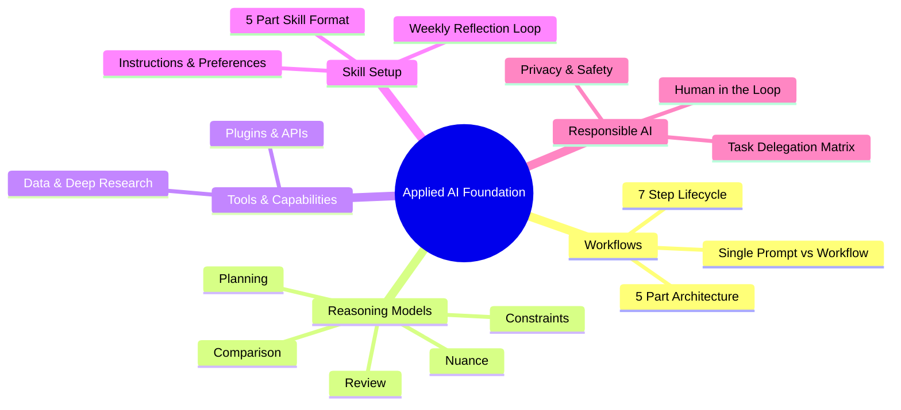
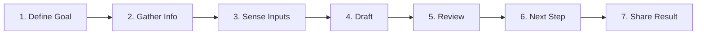

# 🚀 Applied AI Foundation – Digital Notes & Workflow Guide

[](https://academy.openai.com)
[](#)
[](#)
[](#)

> **Welcome!** These are digitized, structured course notes transcribed and refined from the handwritten lecture notes of the **Applied AI Foundation** course at **OpenAI Academy**. 
> 
> This repository provides a comprehensive framework for building, designing, optimizing, and evaluating **AI Workflows**, utilizing **Reasoning Models**, integrating **Plugins & Project Management Tools (OpenProject, Notion, Slack)**, setting up **AI Skills**, and practicing **Responsible AI**.

---

## 📚 Table of Contents

> - [📘 Module 1: AI Workflows & Foundational Frameworks](./01-ai-workflows-foundation.md)
>   - *AI Workflows vs. Single Prompts*
>   - *The 7-Step Core AI Workflow*
>   - *The 5-Part Workflow Architecture*
>   - *Getting Started & Workflow Selection Criteria*
>
> ---
>
> - [🧠 Module 2: Reasoning Models & Structured Prompting](./02-reasoning-models.md)
>   - *Understanding Long-Thinking Reasoning Models*
>   - *The 5 Power Capabilities of Reasoning*
>   - *Direction vs. Reasoning Model Logic vs. Structured Output*
>   - *The Iterative Refinement Loop & Formula*
>
> ---
>
> - [🛠️ Module 3: Tools, Plugins & AI Capability Selection](./03-tools-plugins-capabilities.md)
>   - *The 3-Module Principle (Simplest Useful Capability)*
>   - *Plugins, External APIs & Agent Integration*
>   - *Project Management Case Study (OpenProject & Kanban)*
>   - *The 3.6 Capability Selection Matrix*
>
> ---
>
> - [📐 Module 4: Workflow Design & Setting Up AI Skills](./04-workflow-design-and-skills.md)
>   - *End-to-End Workflow Design Blueprint*
>   - *Workflow Notes & Purpose*
>   - *Setting Up an AI Skill (5-Part Anatomy)*
>   - *Weekly Reflection Template & Skill Creation*
>
> ---
>
> - [🛡️ Module 5: Responsible AI Workflows & Human-in-the-Loop](./05-responsible-ai-workflows.md)
>   - *The Responsible AI Lifecycle Timeline*
>   - *Systemic & Tactical Evaluation (Drift Detection)*
>   - *Task Categorization Matrix (Repetitive vs. Judgement vs. Automated vs. Non-Delegable)*

---

## 🎯 Executive Summary & Core Takeaways



---

## 📖 Complete Course Digest

### 1. What is an AI Workflow?
An **AI Workflow** is a structured, repeatable sequence of steps designed to solve complex, multi-faceted tasks. While a **single prompt** is prone to missing context or hallucinating on large tasks, an AI workflow introduces clear inputs, intermediate steps, checkpoints, and defined outputs.

#### The 7-Step AI Lifecycle:


#### The 5-Part Workflow Anatomy:
$$\text{Workflow} = \text{Goal} + \text{Context} + \text{Steps} + \text{Checkpoints} + \text{Output}$$

---

### 2. Reasoning Models & Structured Prompting
Reasoning models are built for deep thinking, logical verification, and complex problem-solving.

#### 5 Power Capabilities:
1. **Planning:** Structuring multi-stage strategies and dependencies.
2. **Constraints:** Enforcing boundary rules and safety guardrails.
3. **Comparison:** Systematically evaluating trade-offs across options.
4. **Nuance:** Identifying edge cases and subtle context.
5. **Review:** Auditing outputs against strict quality standards.

#### Prompt Blueprint & Iteration Formula:
$$\text{Goal} + \text{Context} + \text{Guardrails} \longrightarrow \text{Check Work} \longrightarrow \text{Refine}$$

---

### 3. Tools, Plugins & Task Capabilities
Always choose the **simplest useful capability** to ground your work and reduce guessing.

- **Plugins:** Connect AI agents to real-world APIs to fetch live data.
- **Kanban Tracking (OpenProject):** Organize tasks across `To Do` $\rightarrow$ `In Progress` $\rightarrow$ `Review` $\rightarrow$ `Done`.
- **Capability Modalities:** Match sub-tasks to the right tool: *Reasoning, Document Extraction, Data Analysis, Search/Research, Multimodal (Vision/Voice), and Agents*.

---

### 4. Workflow Design & AI Skills
A **Skill** teaches AI how to execute a task *the way you do*.

```
Skill = Instructions + Examples + User Preferences
```

#### 5-Part Skill Structure:
1. **Repeatable Process**
2. **Clear Inputs**
3. **Useful Steps**
4. **Defined Output**
5. **Final Quality Checks**

---

### 5. Responsible AI & Task Delegation
Not all tasks should be fully automated. Use the **Task Categorization Matrix**:

| Task Category | Description | AI Action |
| :--- | :--- | :--- |
| **Repetitive** | Routine, predictable steps | Standardize with templates & prompts |
| **Judgement** | Requires human expertise & context | Human-in-the-loop oversight |
| **Automated** | End-to-end executable tasks | Agentic / scripted execution |
| **Non-Delegable** | High-stakes governance & privacy | **Never fully given to AI** |

---

## 🛠️ Repository Structure

> - [`Applied AI Foundation.pdf`](./Applied AI Foundation.pdf) — Original handwritten lecture notes PDF
> - [`01-ai-workflows-foundation.md`](./01-ai-workflows-foundation.md) — Module 1: AI Workflows & Foundational Frameworks
> - [`02-reasoning-models.md`](./02-reasoning-models.md) — Module 2: Reasoning Models & Structured Prompting
> - [`03-tools-capabilities.md`](./03-tools-plugins-capabilities.md) — Module 3: Tools, Plugins & AI Capability Selection
> - [`04-workflow-design.md`](./04-workflow-design-and-skills.md) — Module 4: Workflow Design & Setting Up AI Skills
> - [`05-responsible-ai.md`](./05-responsible-ai-workflows.md) — Module 5: Responsible AI Workflows & Human Oversight

---

## ✍️ Attribution & Acknowledgments

- **Course:** Applied AI Foundation – OpenAI Academy
- **Notes Created By:** Course Participant
- **Format:** Formatted and digitized for open publishing on GitHub.
