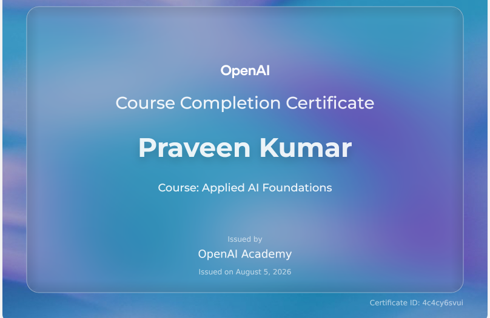

# 🚀 Applied AI Foundations – Course Overview & Notes

> **Welcome!** This directory contains the complete study guide, completion certificate, and handwritten lecture notes for **Applied AI Foundations** at **OpenAI Academy**.

---

## 📜 Course Completion Certificate

> **Recipient:** Praveen Kumar  
> **Course:** Applied AI Foundations  
> **Issued By:** OpenAI Academy  
> **Date:** August 5, 2026  
> **Certificate ID:** `4c4cy6svui`

---

## 📚 Course Files & Navigation

> - [📝 Digitized Study Notes (`dig notes.md`)](./dig%20notes.md)  
>   *Consolidated digital study notes covering AI Workflows, Reasoning Models, Plugins, Skill Setup, and Responsible AI.*
>
> ---
>
> - [📄 Original Handwritten Notes (`Applied AI Foundation.pdf`)](./Applied%20AI%20Foundation.pdf)  
>   *Raw handwritten notes taken during OpenAI Academy lectures.*

---

## ✍️ Attribution & Acknowledgments
- **Course:** Applied AI Foundations – OpenAI Academy
- **Recipient:** Praveen Kumar
- **Certificate ID:** `4c4cy6svui`
