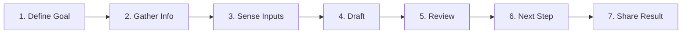

# 🚀 Applied AI Foundations – Digitized Study Notes

> **Course:** OpenAI Academy – Applied AI Foundations  
> **Topic:** AI Workflows, Reasoning Models, Plugins & Capability Selection, Skill Setup, and Responsible AI

---

## 1. AI Workflows vs. Single Prompts

An **AI Workflow** is a structured, repeatable sequence of steps. While a single prompt is insufficient for complex tasks, a workflow makes execution clearer, easier to review, and repeatable.

### The 7-Step AI Workflow Lifecycle

### The 5-Part Workflow Architecture
$$\text{Workflow} = \text{Goal} + \text{Context} + \text{Steps} + \text{Checkpoints} + \text{Output}$$

---

## 2. Reasoning Models & Structured Prompting

Reasoning models perform long-thinking, multi-step logical verification before producing an answer.

### 5 Power Capabilities of Reasoning
1. **Planning:** Multi-stage strategy with dependencies.
2. **Constraints:** Boundary rules & safety guardrails.
3. **Comparison:** Evaluating trade-offs across options.
4. **Nuance:** Capturing edge cases and subtle context.
5. **Review:** Auditing outputs against quality standards.

### Prompt Refinement Formula
$$\text{Goal} + \text{Context} + \text{Guardrails} \longrightarrow \text{Check Work} \longrightarrow \text{Refine}$$

---

## 3. Tools, Plugins & Model Capabilities

Choose the **simplest useful capability** to ground work and eliminate hallucinations.

* **Plugins:** Connect AI agents to external APIs for live data retrieval.
* **Project Management (OpenProject Kanban):**  
  `To Do` $\longrightarrow$ `In Progress` $\longrightarrow$ `Review` $\longrightarrow$ `Done`
* **3.6 Capability Matrix:** Match sub-tasks to specific modalities (*Reasoning, Document Extraction, Spreadsheets/Data, Web Search, Multimodal Vision/Voice, Agents*).

---

## 4. Workflow Design & Setting Up AI Skills

A **Skill** teaches AI how to execute a task *the way you do*.

$$\text{Skill} = \text{Instructions} + \text{Examples} + \text{User Preferences}$$

### 5-Part Skill Format
1. **Repeatable Process** (Routine description)
2. **Clear Inputs** (Data & files required)
3. **Useful Steps** (Execution rules)
4. **Defined Output** (Standardized template)
5. **Final Quality Checks** (Verification checklist)

---

## 5. Responsible AI & Task Delegation Matrix

| Task Category | Description | Delegation Action |
| :--- | :--- | :--- |
| **Repetitive** | Routine, predictable steps | Standardize with templates & prompts |
| **Judgement** | Requires human expertise & context | Human-in-the-loop oversight |
| **Automated** | End-to-end executable tasks | Agentic / scripted execution |
| **Non-Delegable** | High-stakes governance & privacy | **Never fully given to AI** |
