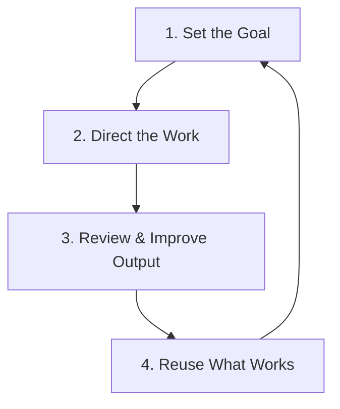
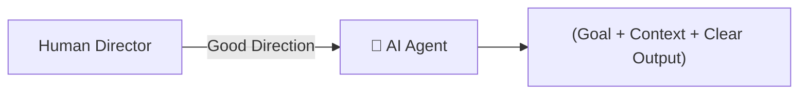

# Module 1: Agent & Workflow Fundamentals

> **Source Course:** OpenAI Academy – Agents and Workflows  
> **Topic:** Human vs. Agent Division of Labor, The 4-Step Cycle, and What an Agent Needs

---

## 1. Overview & Core Philosophy

An **AI Agent** takes scattered, unstructured context and transforms it into useful, structured output.

```
Scattered Context ☁️  ──────>  AI Agent (Organizing Work)  ──────>  Useful Output 🎯
```

### Division of Responsibility: Human vs. Agent

| Human Responsibility 🧑‍💻 | AI Agent Responsibility 🤖 |
| :--- | :--- |
| **Judgement:** Making high-stakes choices | **Organization:** Sorting & structuring scattered inputs |
| **Decisions:** Selecting final strategic paths | **Manual Work:** Drafting, formatting, & data synthesis |
| **Direction:** Defining goals, rules, & scope | **Execution:** Following instructions & steps |

---

## 2. The 4-Step Agent Workflow Cycle

To effectively direct an AI Agent, follow this continuous 4-stage cycle:



1. **Set the Goal:** Clearly define the objective and target deliverable.
2. **Direct the Work:** Provide explicit instructions, context, boundaries, and formatting rules.
3. **Review & Improve Output:** Inspect the generated output, identify gaps, and refine the instructions.
4. **Reuse What Works:** Package successful instructions into reusable templates and skills.

---

## 3. What an Agent Needs to Do a Good Job

For an AI Agent to perform reliably without hallucination or drift, you must supply **5 Essential Pillars**:

```
┌────────────────────────────────────────────────────────────────────────┐
│                        5 Pillars of Agent Direction                    │
├──────────────┬───────────────┬────────────────┬──────────────┬─────────┤
│   1. Goal    │  2. Context   │3. Construction │  4. Output   │5. Review│
│ (Target Result)(Background Info) (Boundaries)  (Deliverable) (Checklist)│
└──────────────┴───────────────┴────────────────┴──────────────┴─────────┘
```

1. **Goal:** The specific outcome or deliverable.
2. **Context:** Background information, source documents, and constraints.
3. **Construction (Boundaries):** Guardrails, formatting rules, and things *not* to do.
4. **Output:** The exact structure, tone, and schema of the deliverable.
5. **Review Check:** Feedback loop to evaluate the draft, refine instructions, and try again.

---

## 4. Good Direction vs. Bad Direction



> **Rule of Thumb:** A good direction gives the agent a clear **Goal**, sufficient **Context**, and a concrete **Output definition**. Never leave the agent guessing its role or purpose.
