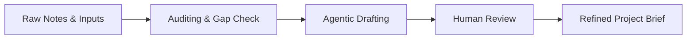

# Module 2: Project Brief Workflows & Prompt Blueprints

> **Source Course:** OpenAI Academy – Agents and Workflows  
> **Topic:** Starting with One Workflow, Project Brief Creation, and Information Auditing

---

## 1. Starting with One Workflow

Do not try to automate everything at once. Begin with a single, highly practical workflow:

$$\text{Context} \longrightarrow \text{Direct} \longrightarrow \text{Improve} \longrightarrow \text{Reuse } (\text{⚙️})$$

### Case Study: Project Brief Document Workflow
A **Project Brief** is an ideal candidate for an agentic workflow because:
- It is **useful** and **concrete**.
- It is **easy to review**.
- It produces a **clear output**.
- It serves a **specific job** within an organization.

---

## 2. Information Auditing & Gap Identification (Lesson 3.2)

Before directing an agent to write a project brief, audit your raw notes and context by asking the following key questions:

```markdown
1. What is the main project goal?
2. What risks or concerns appear in the notes?
3. What decisions have already been made?
4. What information still seems unclear or incomplete?
```

> **Tip:** Identifying unclear or missing information *before* generation prevents the agent from making false assumptions or introducing hallucinations.

---

## 3. The Project Brief Generation Workflow



### The Project Brief Blueprint Structure
A standardized Project Brief generated by an agent should contain:
1. **Executive Summary & Goal:** Objective of the initiative.
2. **Key Decisions Made:** Agreed-upon architecture, budget, or scope.
3. **Risks & Concerns:** Known bottlenecks, technical debt, or external dependencies.
4. **Open Questions / Unclear Info:** Gaps requiring stakeholder input.
5. **Action Plan & Next Steps:** Assigned tasks and timelines.
