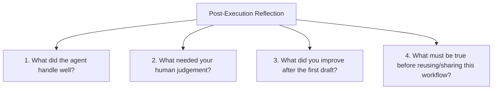

# Module 3: Packaging Skills, Workflow Discovery & Reflection

> **Source Course:** OpenAI Academy – Agents and Workflows  
> **Topic:** Packaging Workflows into Reusable Skills, Practical Prompting Templates, and Post-Execution Reflection

---

## 1. Packaging & Reusing Workflows (Section 4.2)

Once a workflow produces clean results, package it into an **AI Skill** to preserve the tone, structure, and execution flow:

```
Workflow  ──>  Refine Instructions & Templates  ──>  Reusable AI Skill
```

### What is a Project Brief Skill?
A **Project Brief Skill** is a reusable instruction set that captures:
- The exact **system instructions** and rules.
- The required **input structure**.
- The standardized **output format** developed throughout the course.

---

## 2. Workflow Discovery Prompt Blueprint (Section 4.3)

Use the following structured prompt template to ask an AI agent to recommend practical workflows tailored to your daily role:

```markdown
My Role: [Insert your job title / role]
Tasks I do often: [List 3-5 frequent tasks]
Tools & sources I use: [List tools like Jira, Notion, Slack, GitHub, Docs]

Recommend 3 practical workflows I could try next.
For each one, tell me:
1. Why it is a good fit
2. What output it would create
3. What context I would need to provide

Keep the recommendations practical and easy to test.
```

---

## 3. Post-Execution Reflection Framework (Section 5.2)

After running an agentic workflow, evaluate its performance using these 4 reflection questions:



> **Goal:** Continuous reflection ensures your AI skills improve with every execution, making future workflows faster and more reliable.
