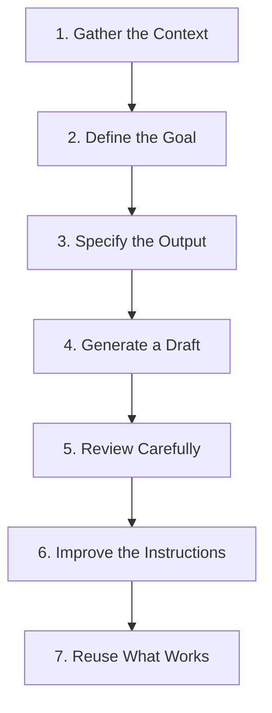

# Module 4: The 7 Foundation Steps of Agentic Execution

> **Source Course:** OpenAI Academy – Agents and Workflows  
> **Topic:** The Complete 7-Step Foundation from Context Gathering to Workflow Reuse

---

## 1. The 7 Foundation Steps

To successfully delegate tasks to an AI Agent—such as generating a Project Brief—follow the complete 7-step lifecycle:

---

## 2. Breakdown of the 7 Steps

| Step | Phase | Action & Description |
| :---: | :--- | :--- |
| **1** | **Preparation** | **Gather the Context:** Collect all raw notes, background data, and source materials. |
| **2** | **Preparation** | **Define the Goal:** Establish the exact objective of the agent task. |
| **3** | **Specification** | **Specify the Output:** Define the format, schema, tone, and structural requirements. |
| **4** | **Execution** | **Generate a Draft:** Have the AI agent run the workflow and produce the initial output. |
| **5** | **Evaluation** | **Review Carefully:** Inspect the draft for accuracy, logic, missing details, or hallucinations. |
| **6** | **Refinement** | **Improve the Instructions:** Fine-tune prompts, system rules, or input context based on review. |
| **7** | **Standardization** | **Reuse What Works:** Package the finalized workflow into a permanent, reusable AI Skill. |

---

## 3. The Lifecycle Vision

$$\text{Project Brief Process} \xrightarrow{\quad \text{7-Step Lifecycle} \quad} \text{Project Brief Skill } (\text{Reusable System})$$

> **Summary:** By following these 7 foundational steps, any manual, repetitive project management task can be turned into a standardized, reusable AI Skill that saves hours of effort while maintaining high quality.
