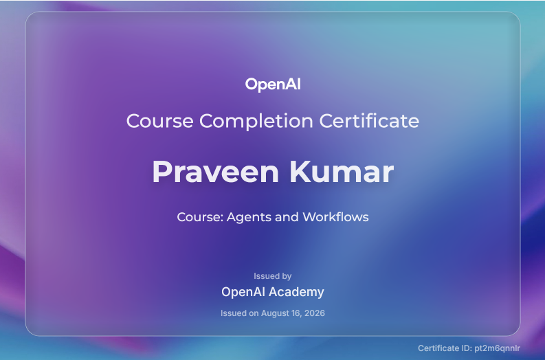

# 🤖 Agents and Workflows – Course Overview & Notes

> **Welcome!** This directory contains the complete study guide, completion certificate, and handwritten lecture notes for **Agents and Workflows** at **OpenAI Academy**.

---

## 📜 Course Completion Certificate

> **Recipient:** Praveen Kumar  
> **Course:** Agents and Workflows  
> **Issued By:** OpenAI Academy  
> **Date:** August 16, 2026  
> **Certificate ID:** `pt2m6qnnlr`

---

## 📚 Course Files & Navigation

> - [📝 Digitized Study Notes (`dig notes.md`)](./dig%20notes.md)  
>   *Consolidated digital study notes covering Division of Labor, 4-Step Agent Cycle, Project Brief Workflows, Reusable Skills, and 7 Foundation Steps.*
>
> ---
>
> - [📄 Original Handwritten Notes (`agents and workflows.pdf`)](./agents%20and%20workflows.pdf)  
>   *Raw handwritten notes taken during OpenAI Academy lectures.*

---

## ✍️ Attribution & Acknowledgments
- **Course:** Agents and Workflows – OpenAI Academy
- **Recipient:** Praveen Kumar
- **Certificate ID:** `pt2m6qnnlr`
