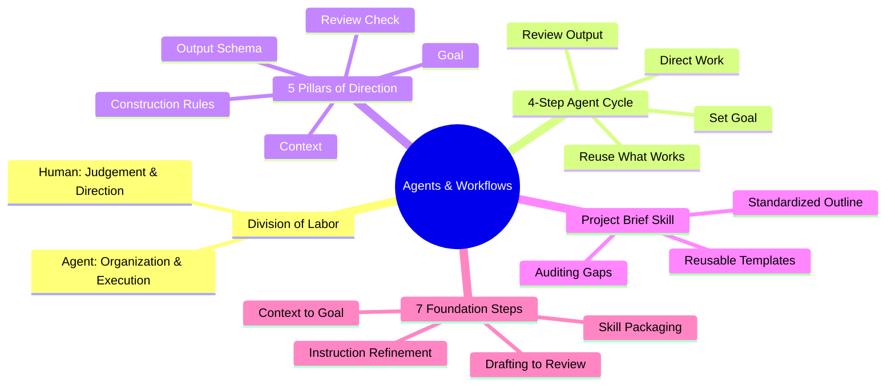
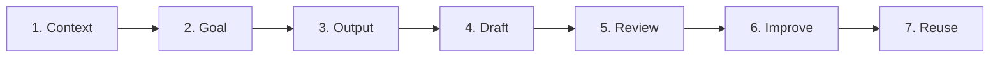

# 🤖 Agents and Workflows – Digital Notes & Execution Guide

[](https://academy.openai.com)
[](#)
[](#)
[](#)

> **Welcome!** These are digitized, structured course notes transcribed and refined from the handwritten lecture notes of the **Agents and Workflows** course at **OpenAI Academy**.
> 
> This repository provides an end-to-end framework for understanding **Human vs. Agent Division of Labor**, mastering the **4-Step Agent Cycle**, auditing **Project Brief Workflows**, packaging reusable **AI Skills**, and executing the **7 Foundation Steps of Agentic Execution**.

---

## 📜 Course Completion Certificate


> **Recipient:** Praveen Kumar  
> **Course:** Agents and Workflows  
> **Issued By:** OpenAI Academy  
> **Date:** August 16, 2026  
> **Certificate ID:** `pt2m6qnnlr`

---

## 📚 Table of Contents

> - [🤖 Module 1: Agent & Workflow Fundamentals](./01-agent-workflow-fundamentals.md)
>   - *Human vs. Agent Division of Labor*
>   - *The 4-Step Agent Workflow Cycle*
>   - *The 5 Essential Pillars of Agent Direction*
>   - *Good Direction vs. Bad Direction*
>
> ---
>
> - [📋 Module 2: Project Brief Workflows & Prompt Blueprints](./02-project-briefs-and-prompts.md)
>   - *Starting with One Workflow*
>   - *Auditing Notes & Gap Identification (Lesson 3.2)*
>   - *Project Brief Generation Workflow & Blueprint*
>
> ---
>
> - [📦 Module 3: Packaging Skills, Workflow Discovery & Reflection](./03-packaging-skills-and-reflection.md)
>   - *Packaging Workflows into Reusable AI Skills*
>   - *Workflow Discovery Prompt Blueprint*
>   - *Post-Execution Reflection Framework*
>
> ---
>
> - [🔄 Module 4: The 7 Foundation Steps of Agentic Execution](./04-the-7-step-agent-lifecycle.md)
>   - *The Complete 7-Step Agent Lifecycle*
>   - *Lifecycle Breakdown (Preparation $\rightarrow$ Execution $\rightarrow$ Standardization)*
>   - *Turning Project Brief Processes into Reusable Skills*

---

## 🎯 Executive Summary & Core Takeaways



---

## 📖 Complete Course Digest

### 1. Human vs. Agent Division of Labor
An AI agent transforms **scattered context** into **useful output**.

```
Scattered Context ☁️  ──────>  AI Agent  ──────>  Useful Output 🎯
```

- **Human Responsibilities:** Judgement, strategic decisions, and defining direction.
- **Agent Responsibilities:** Sorting scattered context, manual drafting, and structured synthesis.

---

### 2. The 4-Step Agent Workflow Cycle
$$\text{Set Goal} \longrightarrow \text{Direct Work} \longrightarrow \text{Review Output} \longrightarrow \text{Reuse What Works}$$

---

### 3. The 5 Pillars of Agent Direction
To prevent agent drift or hallucinations, provide:
1. **Goal:** Target deliverable.
2. **Context:** Background documents.
3. **Construction:** Boundaries & guardrails.
4. **Output:** Expected schema/format.
5. **Review Check:** Feedback & iteration loop.

---

### 4. The 7 Foundation Steps of Execution


---

## 🛠️ Repository Structure

> - [`certificate-pt2m6qnnlr.png`](./certificate-pt2m6qnnlr.png) — Course Completion Certificate
> - [`agents and workflows.pdf`](./agents%20and%20workflows.pdf) — Original handwritten lecture notes PDF
> - [`01-agent-workflow-fundamentals.md`](./01-agent-workflow-fundamentals.md) — Module 1: Agent & Workflow Fundamentals
> - [`02-project-briefs-and-prompts.md`](./02-project-briefs-and-prompts.md) — Module 2: Project Brief Workflows & Prompt Blueprints
> - [`03-packaging-skills-and-reflection.md`](./03-packaging-skills-and-reflection.md) — Module 3: Packaging Skills, Discovery & Reflection
> - [`04-the-7-step-agent-lifecycle.md`](./04-the-7-step-agent-lifecycle.md) — Module 4: The 7 Foundation Steps of Agentic Execution

---

## ✍️ Attribution & Acknowledgments

- **Course:** Agents and Workflows – OpenAI Academy
- **Recipient:** Praveen Kumar
- **Certificate ID:** `pt2m6qnnlr`
- **Format:** Formatted and digitized for open publishing on GitHub.
