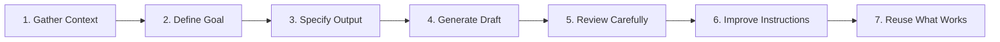

# 🤖 Agents and Workflows – Digitized Study Notes

> **Course:** OpenAI Academy – Agents and Workflows  
> **Topic:** Human vs. Agent Division of Labor, The 4-Step Agent Cycle, Project Brief Workflows, Reusable Skills, and The 7 Foundation Steps

---

## 1. Human vs. Agent Division of Labor

An **AI Agent** takes scattered, unstructured context and transforms it into useful, structured output.

```
Scattered Context ☁️  ──────>  AI Agent (Organizing Work)  ──────>  Useful Output 🎯
```

| Human Responsibility 🧑‍💻 | AI Agent Responsibility 🤖 |
| :--- | :--- |
| **Judgement:** Making high-stakes choices | **Organization:** Sorting & structuring scattered inputs |
| **Decisions:** Selecting final strategic paths | **Manual Work:** Drafting, formatting, & data synthesis |
| **Direction:** Defining goals, rules, & scope | **Execution:** Following instructions & steps |

---

## 2. The 4-Step Agent Cycle & 5 Pillars of Direction

$$\text{Set Goal} \longrightarrow \text{Direct Work} \longrightarrow \text{Review Output} \longrightarrow \text{Reuse What Works}$$

### 5 Pillars of Agent Direction
1. **Goal:** Target outcome or deliverable.
2. **Context:** Background information & raw documents.
3. **Construction:** Boundaries, formatting rules, & guardrails.
4. **Output:** Expected schema, tone, & structure.
5. **Review Check:** Feedback loop to refine instructions and iterate.

---

## 3. Project Brief Workflows & Information Auditing

A **Project Brief** is an ideal candidate for an agentic workflow because it is concrete, easy to review, and serves a specific job.

### Information Auditing (Lesson 3.2)
Before generating a project brief, audit raw notes by asking:
- What is the main project goal?
- What risks or concerns appear in the notes?
- What decisions have already been made?
- What information still seems unclear or incomplete?

---

## 4. Reusable AI Skills & Reflection Framework

Package successful workflows into an **AI Skill** capturing instructions, structure, and output formats.

### Post-Execution Reflection Framework
After running a workflow, reflect on:
1. What did the agent handle well?
2. What needed human judgement?
3. What did you improve after the first draft?
4. What must be true before reusing or sharing this workflow?

---

## 5. The 7 Foundation Steps of Agentic Execution



$$\text{Project Brief Process} \xrightarrow{\quad \text{7-Step Lifecycle} \quad} \text{Project Brief Skill } (\text{Reusable System})$$
